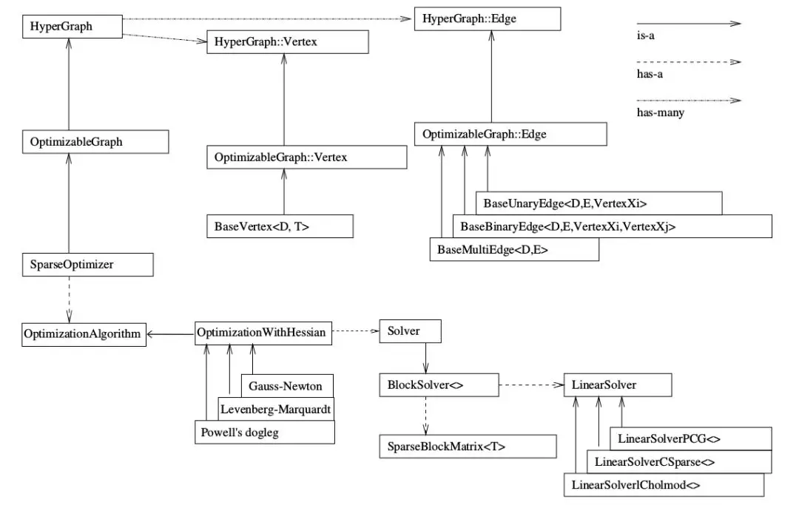
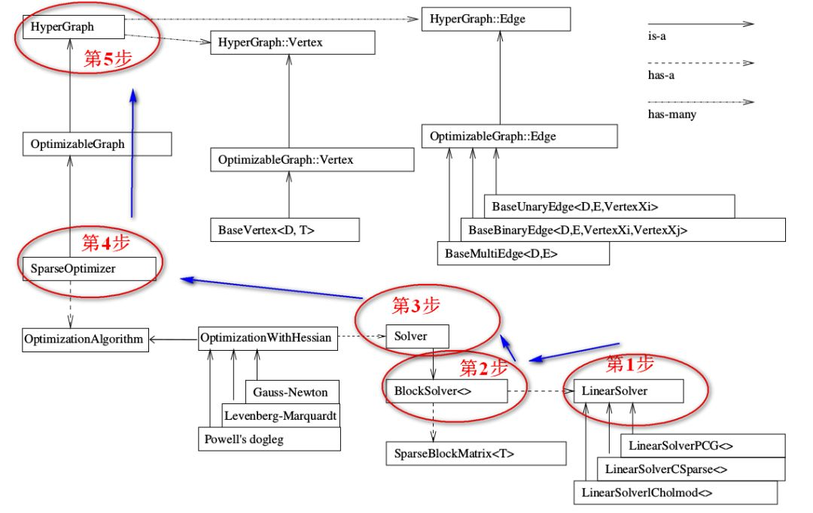

# g2o使用总结

https://blog.csdn.net/hzwwpgmwy/article/details/79884070

https://mp.weixin.qq.com/s?__biz=MzIxOTczOTM4NA==&mid=2247486858&idx=1&sn=ce458d5eb6b1ad11b065d71899e31a04&chksm=97d7e81da0a0610b1e3e12415b6de1501329920c3074ab5b48e759edbb33d264a73f1a9f9faf&scene=21#wechat_redirect



顶点代表优化变量，边代表误差项，几元边代表误差项与几个优化变量相关


编程的流程：



```cpp
//https://github.com/gaoxiang12/slambook/edit/master/ch6/g2o_curve_fitting/main.cpp

typedef g2o::BlockSolver< g2o::BlockSolverTraits<3,1> > Block;  // 每个误差项优化变量维度为3，误差值维度为1

// 第1步：创建一个线性求解器LinearSolver
Block::LinearSolverType* linearSolver = new g2o::LinearSolverDense<Block::PoseMatrixType>(); 

// 第2步：创建BlockSolver。并用上面定义的线性求解器初始化
Block* solver_ptr = new Block( linearSolver );      

// 第3步：创建总求解器solver。并从GN, LM, DogLeg 中选一个，再用上述块求解器BlockSolver初始化
g2o::OptimizationAlgorithmLevenberg* solver = new g2o::OptimizationAlgorithmLevenberg( solver_ptr );

// 第4步：创建终极大boss 稀疏优化器（SparseOptimizer）
g2o::SparseOptimizer optimizer;     // 图模型
optimizer.setAlgorithm( solver );   // 设置求解器
optimizer.setVerbose( true );       // 打开调试输出

// 第5步：定义图的顶点和边。并添加到SparseOptimizer中
CurveFittingVertex* v = new CurveFittingVertex(); //往图中增加顶点
v->setEstimate( Eigen::Vector3d(0,0,0) );
v->setId(0); //确定在H矩阵中的位置
optimizer.addVertex( v );
for ( int i=0; i<N; i++ )    // 往图中增加边
{
  CurveFittingEdge* edge = new CurveFittingEdge( x_data[i] );
  edge->setId(i);
  edge->setVertex( 0, v );                // 设置连接的顶点
  edge->setMeasurement( y_data[i] );      // 观测数值
  edge->setInformation( Eigen::Matrix<double,1,1>::Identity()*1/(w_sigma*w_sigma) ); // 信息矩阵：协方差矩阵之逆
  optimizer.addEdge( edge );
}

// 第6步：设置优化参数，开始执行优化
optimizer.initializeOptimization();
optimizer.optimize(100);
```


g2o的Vertex

```cpp
  template <int D, typename T>  // D是int型，表示vertex的最小维度，但不是顶点的维度，而是其在流行空间中的最小表示。T是待估计vertex的数据类ixng
  class BaseVertex : public OptimizableGraph::Vertex 
```


g2o定义的常用顶点

```cpp
VertexSE2 : public BaseVertex<3, SE2>  //2D pose Vertex, (x,y,theta)
VertexSE3 : public BaseVertex<6, Isometry3>  //6d vector (x,y,z,qx,qy,qz) (note that we leave out the w part of the quaternion)
VertexPointXY : public BaseVertex<2, Vector2>
VertexPointXYZ : public BaseVertex<3, Vector3>
VertexSBAPointXYZ : public BaseVertex<3, Vector3>

// SE3 Vertex parameterized internally with a transformation matrix and externally with its exponential map
VertexSE3Expmap : public BaseVertex<6, SE3Quat> // 李代数位姿

// SBACam Vertex, (x,y,z,qw,qx,qy,qz),(x,y,z,qx,qy,qz) (note that we leave out the w part of the quaternion.
// qw is assumed to be positive, otherwise there is an ambiguity in qx,qy,qz as a rotation
VertexCam : public BaseVertex<6, SBACam>

// Sim3 Vertex, (x,y,z,qw,qx,qy,qz),7d vector,(x,y,z,qx,qy,qz) (note that we leave out the w part of the quaternion.
VertexSim3Expmap : public BaseVertex<7, Sim3>
```


自定义顶点

```cpp
virtual bool read(std::istream& is);
virtual bool write(std::ostream& os) const;
virtual void oplusImpl(const number_t* update);
virtual void setToOriginImpl(); // 顶点重置函数，即设置优化变量的初始值

v->estimate() 返回节点的估计值
```


添加顶点

```cpp
CurveFittingVertex* v = new CurveFittingVertex();
v->setEstimate( Eigen::Vector3d(0,0,0) ); // 设置顶点初始值，即优化变量的初值
v->setId(0); // 只有一个顶点，直接设置为0
optimizer.addVertex( v );
```

```cpp
int index = 1;
for ( const Point3f p:points_3d )   // landmarks
{
    g2o::VertexSBAPointXYZ* point = new g2o::VertexSBAPointXYZ();
    point->setId ( index++ );
    point->setEstimate ( Eigen::Vector3d ( p.x, p.y, p.z ) );
    point->setMarginalized ( true ); // 边缘化
    optimizer.addVertex ( point );
}
```

**注**

视觉SLAM中的边缘化（Marginalization）：求解H dx = g的时候，直接对H矩阵求逆，运算量很大。而H矩阵是具有稀疏性的。可以将H矩阵分为四块，左上角为相机位姿，右下角为路标位姿。经过高斯消元，可以让相机位姿的求解不依赖与路标位姿。这种方法奏效的原因是路标块为对角块，求逆容易。求解了相机位姿后求解路标方程也比较容易。

但g2o默认所有位姿顶点都不被边缘化，所有路标点都被边缘化。


g2o中的边

```cpp
 BaseBinaryEdge<2, Vector2D, VertexSBAPointXYZ, VertexSE3Expmap> //error维度，error数据类型，不同顶点类型
```

```cpp
virtual bool read(std::istream& is);
virtual bool write(std::ostream& os) const;
virtual void computeError(); //当前顶点值计算的测量值与真实的测量值之间的误差
virtual void linearizeOplus(){..._jacobianOplusXi(pos, pos) = something;...} //在当前顶点的值下，误差对优化变量的偏导数（Jacobian）

_measurement：存储观测值
_error：存储computeError() 函数计算的误差
_vertices[]：存储顶点信息，比如二元边的话，_vertices[] 的大小为2，存储顺序和调用setVertex(int, vertex) 是设定的int 有关（0 或1）
setId(int)：来定义边的编号（决定了在H矩阵中的位置）
setMeasurement(type) 函数来定义观测值
setVertex(int, vertex) 来定义顶点
setInformation() 来定义协方差矩阵的逆
```

