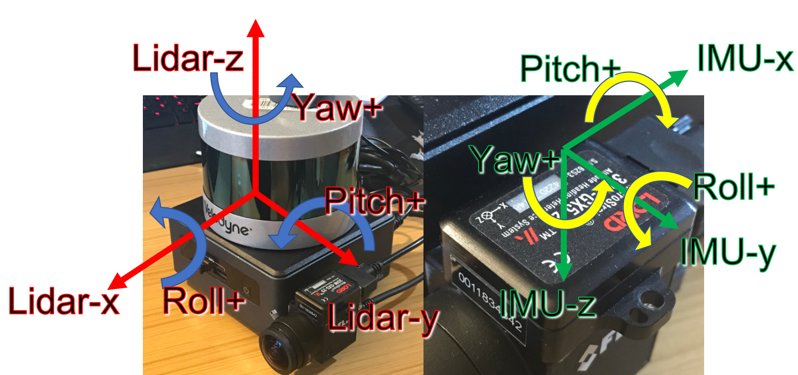
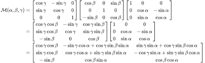

1.  优秀的开源SLAM https://tianchi.aliyun.com/forum/postDetail?postId=64582

   ```
   纯视觉SLAM开源方案：
   稀疏地图
   
   ORB SLAM v2 (单目、双目、RGB-D)
   
   半稠密地图
   
   LSD SLAM (单目、双目、RGB-D)
   
   DSO (单目)
   
   SVO(单目, 仅VO)
   
   稠密地图
   
   RGB-D SLAM  V2 (RGB-D)
   
   Kintinuous (RGB-D)
   
   Elastic Fusion (RGB-D)
   
   Bundle Fusion (RGB-D)
   
   InfiniTAM (RGB-D)
   
   RTAB-Map (RGB-D，双目，LIDAR)
   
   多传感器融合
   VINS (单目+IMU、双目+IMU) ****************
   
   OKVIS (单目+IMU、双目+IMU) ***********
   
   ROVIO (单目+IMU）
   
   RKSLAM (单目+IMU）
   
   Cartographer (LIDAR + IMU)
   
   V-LOAM (单目+LIDAR) **************
   
   和深度学习结合
   CNN-SLAM: 将LSD-SLAM里的深度估计和图像匹配都替换成基于CNN的方法，并可以融合语义
   
   VINet : Visual-inertial odometry as a sequence-to-sequence learning problem: 利用CNN和RNN构建了一个VIO，即输入image和IMU信息，直接输出估计的pose
   
   3DMV: Joint 3D-Multi-View Prediction for 3D Semantic Scene Segmentation: 联合3D多视图预测网络在室内环境中进行RGB-D扫描的3D语义场景分割
   
   ScanComplete: Large-Scale Scene Completion and Semantic Segmentation for 3D Scans: 将场景的不完整3D扫描作为输入，能够预测出完整的3D模型以及每个体素的语义标签
   
   DeepVO: A Deep Learning approach for Monocular Visual Odometry
   
   Lightweight Unsupervised Deep Loop Closure: 用CNN解决闭环问题
   ```

2. **VINS-FUSION** ：**双目+IMU** ，或者双目，可以看看如何融合的

3. LINS----Lidar-inertial-SLAM 紧耦合的**基于ESKF的LIO**算法  https://zhuanlan.zhihu.com/p/134621840,后面可以试试

4. **FAST-LIO**: 基于IEKF的紧耦合LIO

5. 大论文的算法可以试试紧耦合的LIO-SAM,视觉的试试ORB-SLAM2的**双目**，VINS-FUSION的双目。LIO-SAM先跑起来

6. LIO-SAM代码阅读和数据集的演示效果  ：[chennuo0125-HIT](https://github.com/chennuo0125-HIT)/**[LIO-SAM-note](https://github.com/chennuo0125-HIT/LIO-SAM-note)**

   extrinsicRPY 和extrinsicRot：使用两个外参旋转的原因是my IMU's inertial reading (acc and gyro) frame is different from the orientation frame. The pitch of my IMU is rotating around IMU-x. The pitch of the lidar is rotating around Lidar-y. Thus I use extrinsicRPY to rotate IMU orientation -90 degrees to the lidar frame, so they can be consistent.  **extrinsicRPY让LIDAR和IMU的旋转一致**



 代码中的  extrinsicRPY: [0,  1, 0,                        extrinsicRot: [-1, 0, 0,

​                                           -1, 0, 0,                                                 0, 1, 0,

​                                            0, 0, 1]                                                 0, 0, -1]

extrinsicRPY的值根据下图可知，gama=-90度，其余两个角为0度，所以根据上图可知，是将IMU的坐标系绕着LIDAR坐标系的z轴顺时针旋转了90度，以让pitch角绕着y轴旋转。相当于**这个旋转对IMU的xyz坐标系没有起作用**，而是让欧拉角坐标系起作用。

extrinsicRot的值根据下图可知，beta=180度，其余两个角为0度，所以根据上图可知，是将IMU的坐标系绕LIDAR的y轴旋转180度，以让两者的xyz坐标轴完全重合。





  LIDAR和IMU安装非常近，所以可以视为没有平移。而且几个坐标轴基本平行，所以外参只有正负1，相当于只是坐标轴进行90度的旋转

 OS1激光雷达坐标系不符合REP规则，所以需要修改 https://github.com/TixiaoShan/LIO-SAM/issues/94

7. ouster和MTi sync without GPS ：https://github.com/TixiaoShan/LIO-SAM/issues/111 
