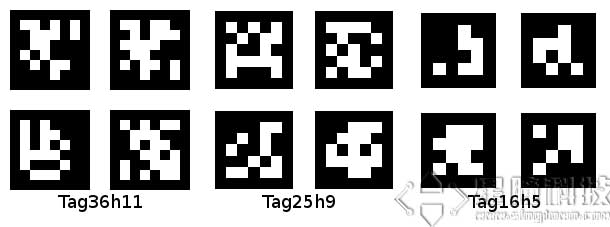
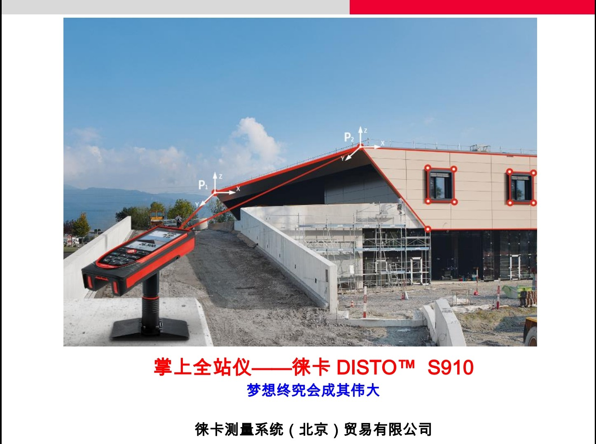
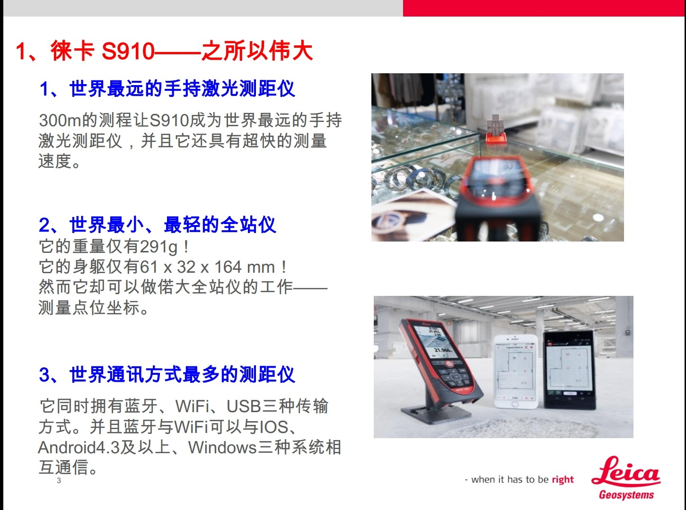
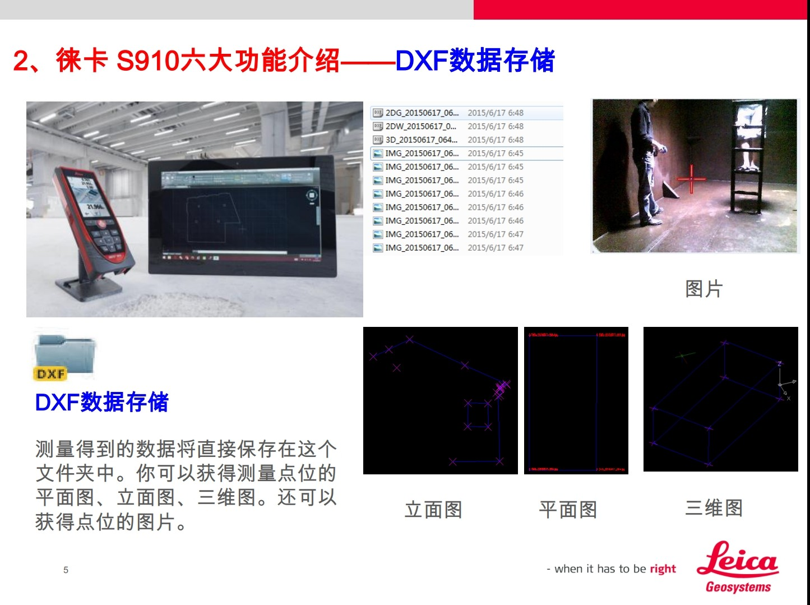
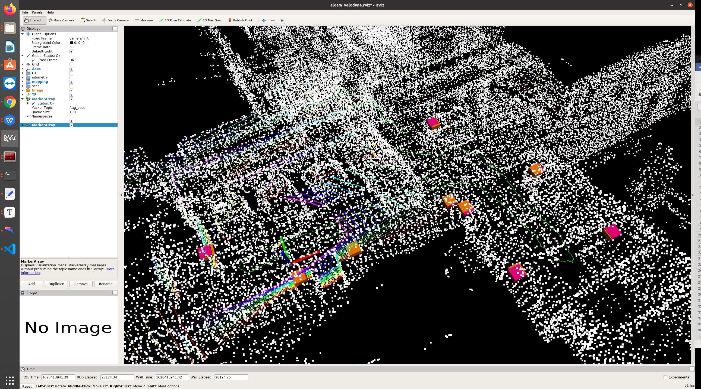

1.  题目是 **地下矿**的**激光SLAM**建图定位方法研究 

2.  地下的算法评价系统：

   地下无GPS信号，所以无法使用RTK得到轨迹真值。但是做实验没有真值，说服力不够。

   我自己设计了一套地下精度测评系统，需要的仪器有全站仪，AprilTag贴纸。

   1) Apriltag介绍

      AprilTag是一个视觉基准系统，可用于各种任务，包括AR，机器人和相机校准。这个tag可以直接用打印机打印出来，贴在目标上，使用AprilTag检测程序可以计算相对于相机的精确3D位置（我自己测试过，1m距离的误差可以达到2cm以内），方向和id。

   

   2. 全站仪：徕卡S910

      300米测距，可以测斜度，角度，距离。生成CAD图纸

      

      

      

​       并且它支持自由设站。比如我们的测量场景的关键点不可能在一个地方测量完成，那么就需要移动全站仪的位置。我们将全站仪移动到新的位置后，只需要测量几个前面测过的点，即可将新位置测的点统一到前面的坐标系中。

   3. 验证实验：

      1. 将AprilTag纸贴在墙上，然后以一个tag中心为原点，设置xyz轴方向，得到一个局部坐标系Ttag。我们利用皮尺将其他tag在Ttag坐标系下的坐标测量得到。这个过程其实就是模拟全站仪测量Tag的坐标。

         

      2. 我将激光雷达和摄像头固定在一起，并标定二者，得到标定矩阵。摄像头负责识别墙上的AprilTag，得到相对于摄像头坐标系的位姿。根据lidar和camera的标定结果，就可以得到相对与lidar系的坐标。

         

      3.  然后我使用Aloam的激光SLAM算法跑采集的激光数据，得到一条轨迹，同时将得到的AprilTag的位姿和轨迹位姿记录下来。然后数据处理得到实时测的的tag在激光SLAM坐标系下的位置。再与我用皮尺得到的tag的相对位置做匹配，最终计算坐标统一后每个对应的tag的位置的距离，以这个距离作为评价指标

         

       这是测试结果，这是在erx5车库采集的lidar数据，跑的Aloam。最终经过坐标转换，红色块是摄像头在SLAM系下测得的tag位置，黄色的是皮尺测量的tag位置（模拟全站仪），重合效果挺好，误差在8cm以内，这个标定误差，皮尺测量误差，算法误差共同的结果。效果还可以。

3. 算法使用设备

   我觉得在地下矿特征稀少的情况下，只跑纯LIDAR可能效果不好，所以想结合IMU。我调研了现在的激光雷达，velodyne, robosense的雷达的时间硬同步只支持GPS的PPS信号，而在地下矿中无GPS信号，所以无法进行时间同步。而IMU和LIDAR时间不同步的算法效果一般都不好。

   LIVOX horizon这款雷达是内置IMU，做好了时间同步的。并且他是固态激光雷达，线束比较密。开源算法的效果不错

   

4. 设备价格： 全站仪 1.2w， livox horizon 7k
5.  测试场地：需要麻烦王老师联系地下矿，墙面最好是有一定平整度的，有一定棱角的。如果是那种没做墙面平整的场景，效果可能会差一些。